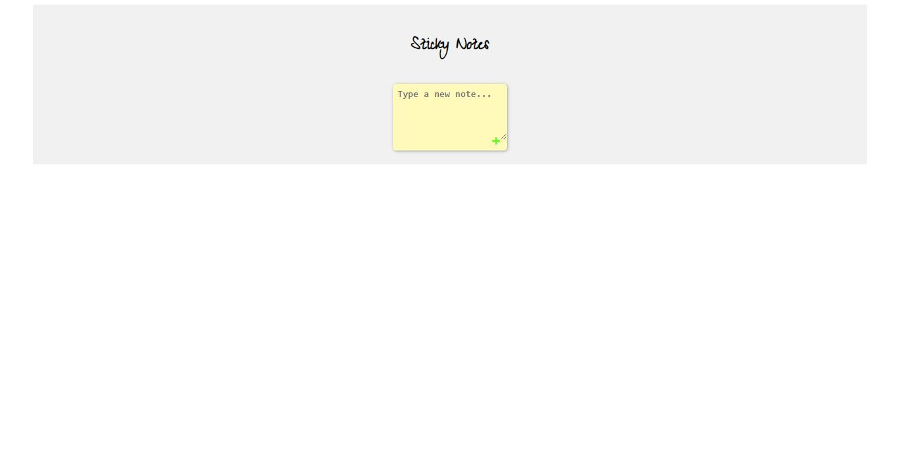
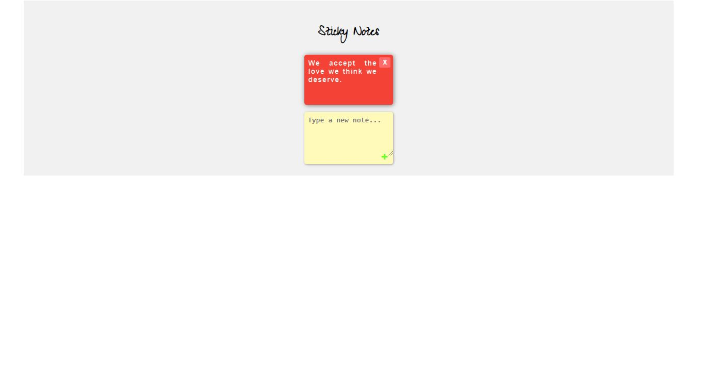
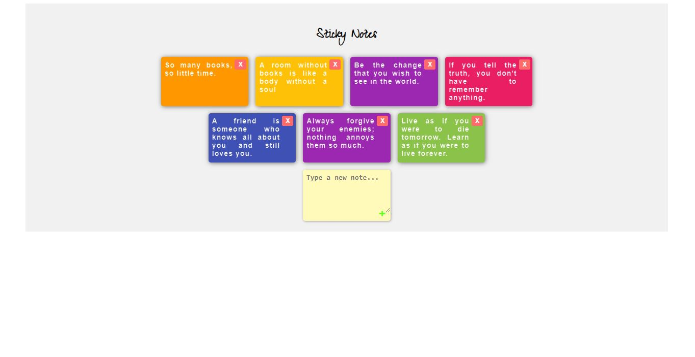

# 🗒️ Sticky Notes

A **Sticky Notes** web application that allows users to create, organize, and manage virtual sticky notes. Built with HTML, CSS, and JavaScript, this app provides a simple yet effective way to jot down quick thoughts, ideas, or reminders and keep them visually organized on your screen.

---

## 🚀 Features

- ✍️ **Create New Notes**: Users can add new sticky notes.
- 🖍️ **Edit Notes**: Easily update or modify the content of a note.
- 🗑️ **Delete Notes**: Remove a note when it's no longer needed.
- 🎨 **Customizable Styles**: Sticky notes come in vibrant colors.

---

## 💻 Technologies Used

- **HTML5**: For structuring the content.
- **CSS3**: For styling the application and creating a clean, colorful, and user-friendly interface.
- **JavaScript (ES6)**: For dynamic behavior, handling user interaction, and managing notes.

---

## 🛠️ Installation and Setup

1. **Clone the repository**:
   ```bash
   git clone https://github.com/mahesh-ly/Sticky-notes
   ```

2. **Open the project folder**:
   ```bash
   cd sticky-notes
   ```

3. **Open `index.html` in your browser** to start using the app.

---

## 🎨 Screenshots

Here's a sneak peek of what the **Sticky Notes** app looks like:





---

## 📂 Project Structure

```bash
📁 sticky-notes
│
├── 📁 screenshots
│   └── Screenshot1.JPG
│   └── Screenshot2.JPG
│   └── Screenshot3.JPG
├── 📄 index.html        # The main HTML file
├── 📄 styles.css    # Styles for the sticky notes and layout
└── 📄 app.js        # JavaScript file for note creation, editing, and deletion
```

---

## 📈 Future Improvements

- 🖼️ **Add Images**: Allow users to attach images to their notes.
- ⏰ **Reminders**: Add the ability to set reminders for specific notes.
- 🌐 **Sync across devices**: Integrate with a backend or cloud storage for syncing notes across different devices.

---

## 🤝 Contributing

Contributions, issues, and feature requests are welcome! Feel free to check out the [issues page](https://github.com/Mahi-Rathod/sticky-notes/issues).

---

### 🌟 Don't forget to give this project a star if you find it useful!

---
